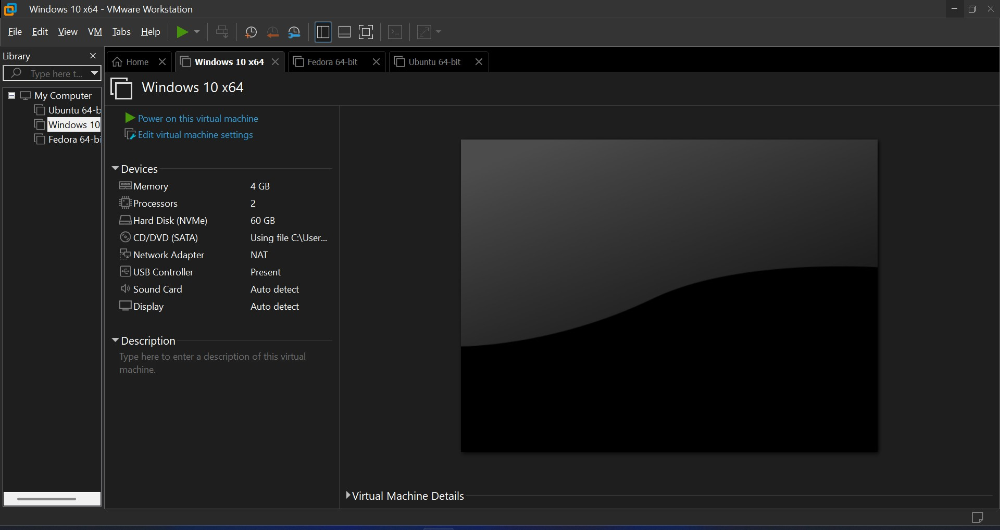
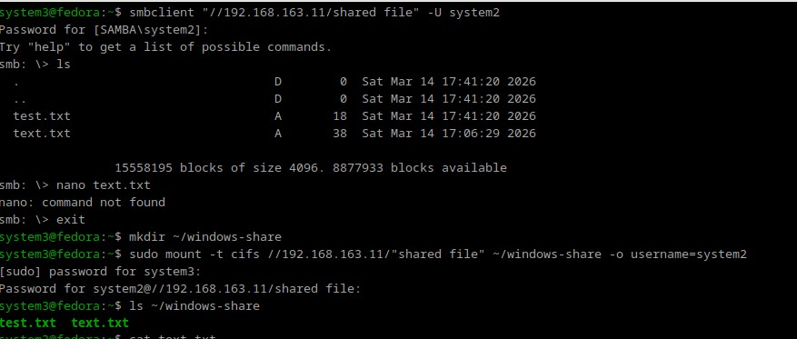
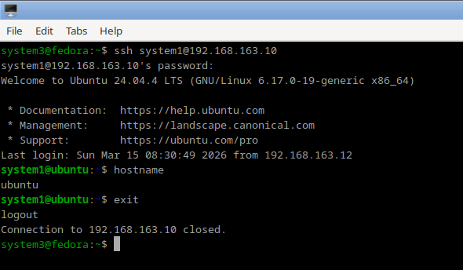

# VMware Virtual Network Lab

A small virtualization lab simulating a multi-machine office network using VMware.  
The environment includes Windows and Linux virtual machines communicating over a private network with static IP configuration, SMB file sharing, and SSH remote access.

## Environment
- Windows 10
- Ubuntu (24.04)
- Fedora 43
  ### VMWare Environment

## Network Configuration
Static IP addresses were assigned to each machine.

Example:
Windows  → 192.168.163.11
Ubuntu   → 192.168.163.10
Fedora   → 192.168.163.12

## Connectivity Testing
Network communication verified using ping.

## File Sharing
A Windows shared folder was accessed from Linux using SMB.
### Shared Folder on Windows

### Accessing the file via Samba on Linux

## Remote Access
SSH configured between Linux machines for remote administration.

